### Curvature filters are efficient solvers for variational models.
Curvature filter was developed by Yuanhao Gong during his PhD at MOSAIC Group. Please cite following papers if you use curvature filter in your work. Thank you!
***
```text
@phdthesis{gong:phd, 
  title={Spectrally regularized surfaces}, 
  author={Gong, Yuanhao}, 
  year={2015}, 
  school={ETH Zurich, Nr. 22616},
  note={http://dx.doi.org/10.3929/ethz-a-010438292}}

@ARTICLE{gong:gdp, 
  author={Gong, Y. and Sbalzarini, I.F.}, 
  journal={Selected Topics in Signal Processing, IEEE Journal of}, 
  title={A Natural-Scene Gradient Distribution Prior and 
  its Application in Light-Microscopy Image Processing}, 
  year={2016}, 
  volume={10}, 
  number={1}, 
  pages={99-114}, 
  doi={10.1109/JSTSP.2015.2506122}, 
  ISSN={1932-4553}, 
  month={Feb}}

@article{gong:Bernstein,
	Author = {Yuanhao Gong},
	Journal = {ICASSP},
	Month = {March},
	Pages = {1701--1705},
	Title = {Bernstein Filter: a new solver for mean curvature regularized models},
	Year = {2016}}
	
@article{gong:gc,
	Author = {Yuanhao Gong and Ivo F. Sbalzarini},
	Journal = {Intl. Conf. Image Proc. (ICIP)},
	Month = {September},
	Pages = {534--538},
	Title = {Local weighted {G}aussian curvature for image processing},
	Year = {2013}}
```
***
:books: Chapter **Six** in **<a href="http://e-collection.library.ethz.ch/eserv/eth:47737/eth-47737-02.pdf" target="_blank">PhD thesis</a>** (downloaded **2000+** since June, 2015, from **40** different countries), Gaussian Curvature Filter (Talk Slides): **<a href="https://www.dropbox.com/s/ax73park0popi4x/GCFilter_small.pdf?dl=0" target="_blank">Dropbox</a>** or **<a href="http://pan.baidu.com/s/1qWrcfqG" target="_blank">Baidu</a>**, **[Bernstein Filter(poster)](images/BernsteinFilter.pdf)**, **source code** in **C++** and **Java** can also be found at **<a href="http://mosaic.mpi-cbg.de/?q=downloads/curvaturefilters", target="_blank">MOSAIC group</a>**(:de:), a short introduction in Chinese: **<a href="http://www.zhihu.com/question/35499791" target="_blank">Zhihu</a>**(:cn:) or **<a href="http://blog.csdn.net/jorg_zhao/article/details/51328966" target="_blank">Blog</a>**(:cn:). The kernels summary and one example how to get the kernel can be found **[here](images/CF_Kernels.pdf)**.

:e-mail: gongyuanhao@gmail.com, or join the **<a href="https://groups.google.com/forum/?hl=en#!forum/curvaturefilter" target="_blank">Curvature Filter Forum</a>**
***
## Curvature filters' philosophy 

Traditional solvers, such as gradient descent or Euler Lagrange Euqation, start at the total energy and use diffusion scheme to carry out the minimization. When the initial condition is the original image, the data fitting energy always increases while the regularization energy always reduces during the optimization, as illustrated in the below figure. Thus, regularization energy must be the dominant part since the total energy has to decrease. 

Therefore, **Curvature filters focus on minimizing the regularization term,** whose minimizers are already known. For example, if the regularization is Gaussian curvature, the developable surfaces minimize this energy. Therefore, in curvature filter, developable surfaces are used to approximate the data. **As long as the decreased amount in the regularization part is larger than the increased amount in the data fitting energy, the total energy is reduced.**

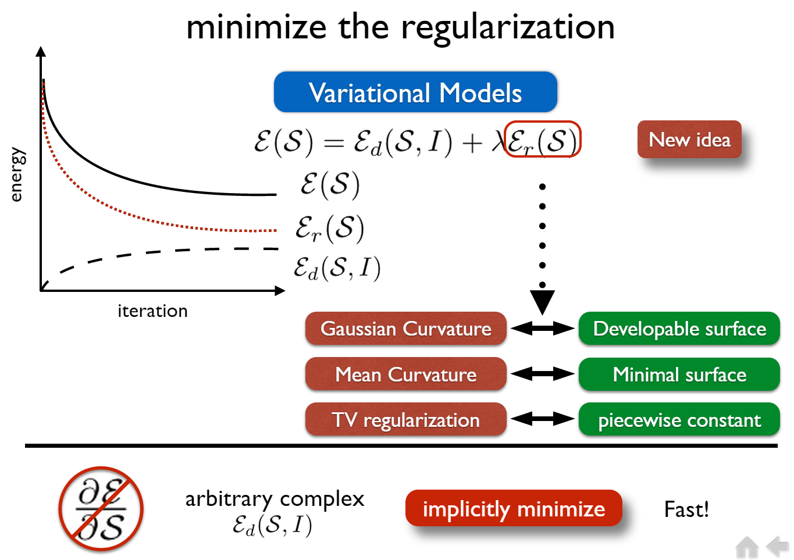
***
## The role of curvature filters
Curvature filters link the variational models with image filters. Meanwhile, they implicitly impose differential geometry.                                                              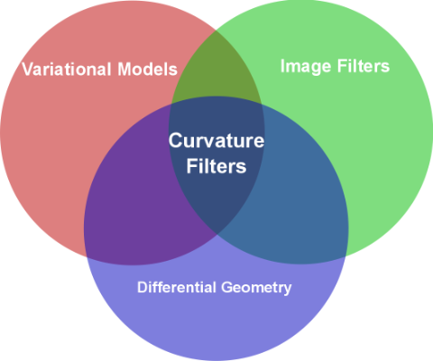
***
## Running Time (100 or 1000 times faster than traditional diffusion)
| Filter       | Bilateral Filter | Guided Filter | Guided Filter | MC Filter | MC Filter | GC Filter | GC Filter| Bernstein Filter |
| ------------- |:-------------:|:-------------:|:-------------:|:-------------:|:-------------:|:-------------:|:-------------:|:-------------:|
| Lang.      | C++ | Matlab | C++ | Matlab | C++ | Matlab | C++| C++|
| MilliSec.      | 103 | 514 | 130 | 300 | 8 | 400 | 11| 7|

Running time with 10 iterations on 512X512 Lena image. Matlab version is R2015a and GCC version is 5.1. All tests are on a Thinkpad T410 with i7-620M core CPU (2.6GHz). We take the time for 100 iterations and divide it by 10. On average, curvature filters take 1 millisecond per iteration.
***
## Features
| Theoretical  | Practical |
| ------------- |:-------------:|
| **Generality**: handle arbitrary data fitting term (BlackBox)  | **Efficient**: three or four order of magnitude faster than traditional solvers  |
| **Convergence**: theoretically guaranteed 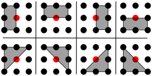 | **Implementation**: 40 lines in Matlab and 100 lines in C++  |

***
## Example Applications
### 1) Only minimize the regularization 
GC = Gaussian Curvature, MC = Mean Curvature, TV = Total Variation
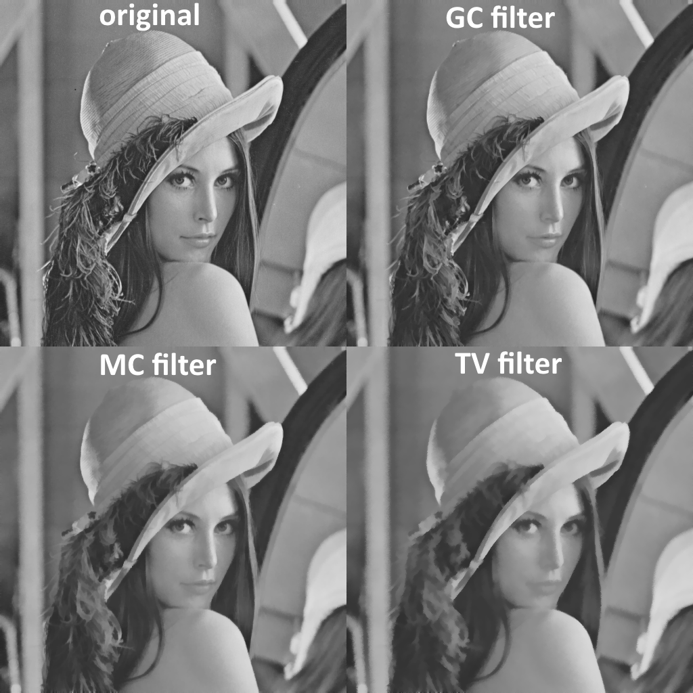
### 2) Minimize a variational model, showing the line profile
We show three lines' profiles during minimizing a mean curvature regularized model (MC filter used). 

| 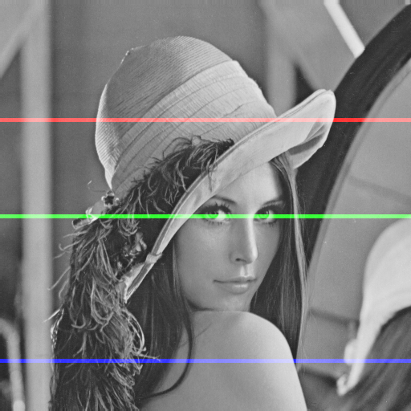      | 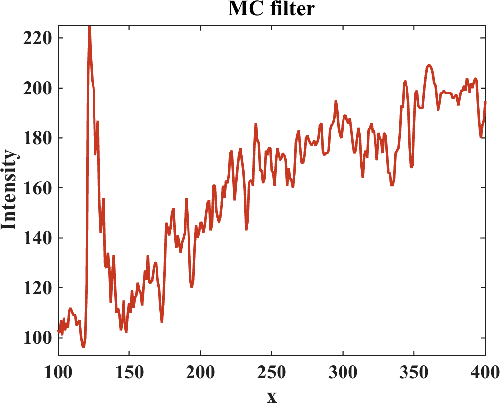 |
| ------------- |:-------------:|
| 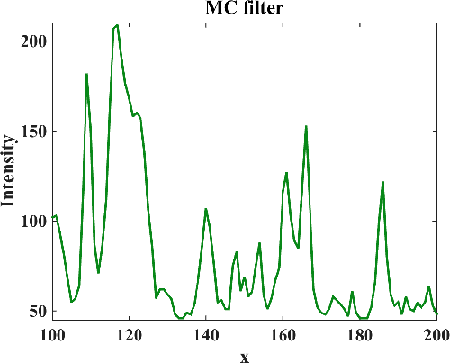      | 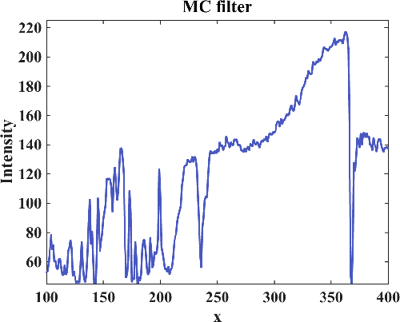 |

### 3) Denoising
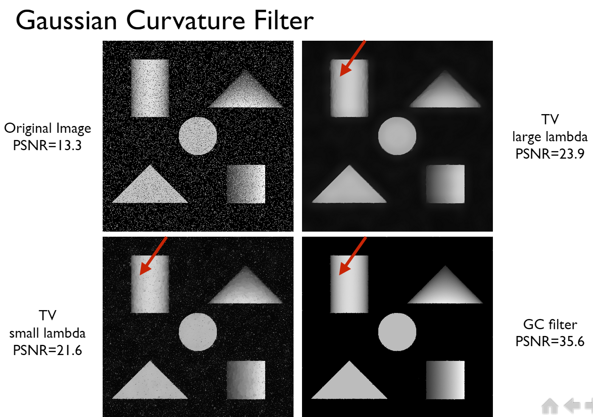
The noise free test image can be downloaded **[here](images/developable.png)**
### 4) Cartoon Texture Decomposition
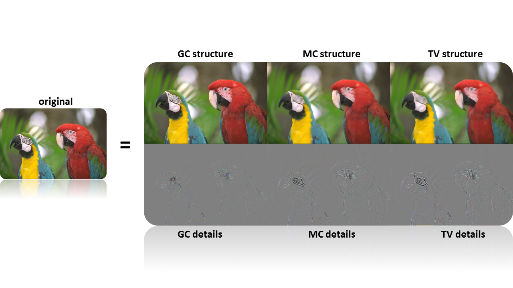
### 5) Registration
from left to right: original reference image, distorted source image, registered results by TV filter, MC filter and GC filter.
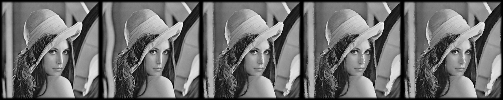
### 6) Curvature Guided Filter
| Original image      | Guided Curvature | Result |
| ------------- |:-------------:|:-------------:|
|       | 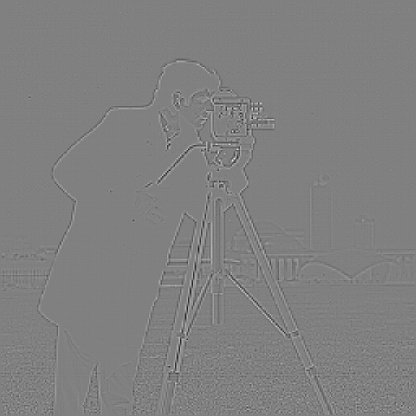 | 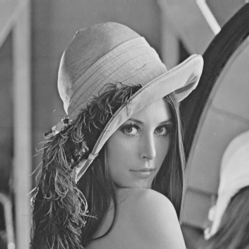 |
### 7) Multi Resolution Analysis
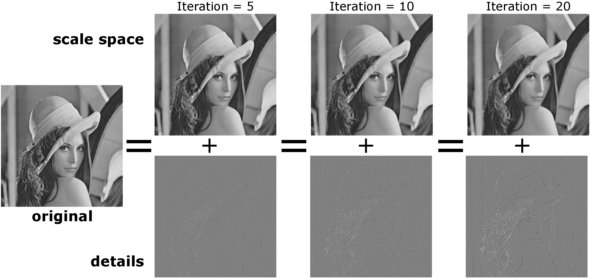

***
## FAQ:
1) Why dual mesh (DM) structure is needed?

There are two reasons. First, these four sets guarantee the convergence. Second, 
we can use the updated neighbors for current position. Therefore, it is more computational efficient.

====
2) What is the difference between these three filters?

In general, GC filter is better in preserving details, compared with the other two. And
TV filter is better in removing noise as well as details. MC filter is between these two.

These three filters are correspond to three types of variational models. User should decide
which prior is to be assumed about the ground truth. 

====
3) What is the difference between split and nosplit scheme?

In general, splitting the image into four sets and looping on them is computational faster.
However, in some cases like deconvolution, we need to merge the four sets after every iteration.
So, it is better do nosplit scheme.

These two lead to exactly the same result. The split code is just more cache friendly.
